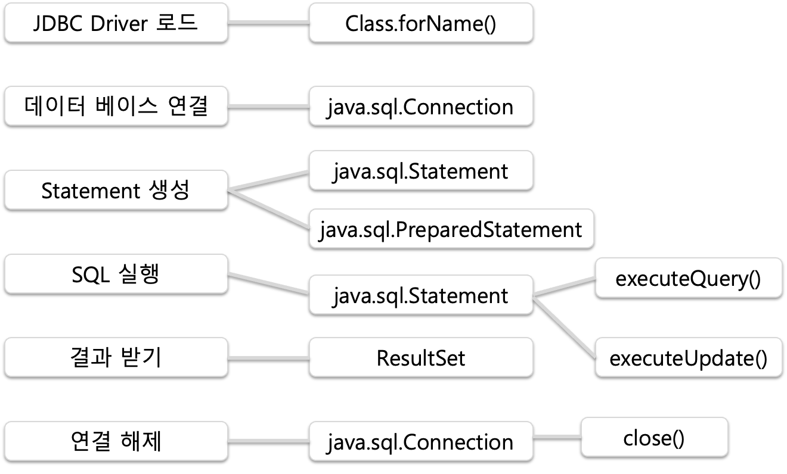

# FISA 클라우드엔지니어링 14일차(MySQL JDBC Connection)

### JDBC 객체



### JDBC Properties 설정

1. db접속 설정 정보를 자바 소스에서 분리
2. 형식
    1. url/id/pw 등을 구분을 위한 고유한 별칭
    2. key, value 구조
    3. properties라는 확장자 파일로 주로 관리
3. Spring Properties 파일의 근원
4. db.properties 파일 임의생성
    1. 자바 소스에서 db.properties read 설정
    2. properties 파일의 key로 매핑된 데이터 사용
    3. IO 또는 Memory에 따라서 Read 기능을 제공하는 API가 구분됨
    4. IO(FileInputStream, FileReader) 사용
5. Property 파일로부터 key를 분리해서 read 해주는 주요 API
    1. Map 스펙 하위 클래스
    2. java.util.Properties 로 key 데이터 구분하면서 read
6. 예외처리
    1. 파일이 없을 경우 try, catch 예외처리 적용

### Properties 사용 JDBC Connection

```sql
import java.io.FileInputStream;
import java.io.FileNotFoundException;
import java.io.IOException;
import java.sql.Connection;
import java.sql.DriverManager;
import java.sql.ResultSet;
import java.sql.Statement;
import java.util.Properties;

import org.junit.Test;

public class ConnectionProperty {
	
	private static Properties p = new Properties();
	
	static {
		try {
			p.load(new FileInputStream("db.properties"));
			Class.forName(p.getProperty("jdbc.driver"));
		}
		catch(Exception e){
			System.out.println("IO문제 발생");
			e.printStackTrace();
		}
	}

	
	@Test
	public void connect() {
        try {
			String jdbcUrl = p.getProperty("jdbc.url");
	        String username = p.getProperty("jdbc.id");
	        String password = p.getProperty("jdbc.pw");
        
            
            // Establish a connection
            Connection connection = DriverManager.getConnection(jdbcUrl, username, password);
            
            // Create a statement
            Statement statement = connection.createStatement();
            
            // Execute a query
            ResultSet resultSet = statement.executeQuery("SELECT * FROM emp");
            
            // Process the result set
            while (resultSet.next()) {
                System.out.println("Column1: " + resultSet.getString("ename"));
                System.out.println("Column2: " + resultSet.getInt("empno"));
            }
            
            // Close the resources
            resultSet.close();
            statement.close();
            connection.close();
        } catch (Exception e) {
            e.printStackTrace();
        }
    }
	
}

```

### 예외처리

- try catch는 Exception을 캐치후 null을 반환함으로 상황에 맞게 사용할 것
- controller에게 예외 전달해줄것 throws SQLException 사용
- try catch 남용금지

```sql
// 접속 객체 생성해서 반환
	// db 접속 문제자체를 호출한 곳으로 처리위임
	// 접속문제 -> ... -> controller에게 접속 이슈 관련된 유연한 처리 유도
	public static Connection getConnection() throws SQLException{
		return DriverManager.getConnection(p.getProperty("jdbc.url"),
										   p.getProperty("jdbc.id"),
										   p.getProperty("jdbc.pw"));
	}
```

### Connection 객체만 받기

**AS IS**

```sql
@Test
	public void connect() {
        try {
			String jdbcUrl = p.getProperty("jdbc.url");
	        String username = p.getProperty("jdbc.id");
	        String password = p.getProperty("jdbc.pw");
        
            
            // Establish a connection
            Connection connection = DriverManager.getConnection(jdbcUrl, username, password);
            
            // Create a statement
            Statement statement = connection.createStatement();
            
            // Execute a query
            ResultSet resultSet = statement.executeQuery("SELECT * FROM emp");
            
            // Process the result set
            while (resultSet.next()) {
                System.out.println("Column1: " + resultSet.getString("ename"));
                System.out.println("Column2: " + resultSet.getInt("empno"));
            }
            
            // Close the resources
            resultSet.close();
            statement.close();
            connection.close();
        } catch (Exception e) {
            e.printStackTrace();
        }
    }
```

**TO BE**

```sql
// catch만 사용해버리면 null 반환해서 클라이언트가 에러를 못봄 throws Exception 사용해주기.
	@Test
	public void connect() throws SQLException{
		Connection connection = null;
		Statement stmt = null;
		ResultSet rs = null;
        try {
            connection = DBUtil.getConnection();
            stmt = connection.createStatement();
            rs = stmt.executeQuery("select * from dept");
        } finally {
        	DBUtil.close(connection, stmt, rs);
        }
    }
```

- DBUtil에 connection 객체를 반환하는 코드 작성
- catch를 사용하지 않음으로써 controller에 예외전달
- finally 코드로 무조건 rs, conn, stmt 커넥션 닫아주기

**DBUtil**

```sql
package step01.basic;

import java.sql.DriverManager;
import java.sql.Connection;
import java.sql.Statement;
import java.sql.ResultSet;
import java.sql.SQLException;
import java.io.FileInputStream;
import java.util.Properties;

public class DBUtil {

	private static Properties p = new Properties();

	static {
		try {
			p.load(new FileInputStream("db.properties"));
			Class.forName(p.getProperty("jdbc.driver"));
		} catch (Exception e) {
			System.out.println("IO문제 발생");
			e.printStackTrace();
		}
	}

	// 접속 객체 생성해서 반환
	// db접속 문제자체를 호출한 곳으로 처리 위임
	// 접속 문제 -> ... -> controller에게 접속 이슈 관련된 유연한 처리 유도
	public static Connection getConnection() throws SQLException {

		return DriverManager.getConnection(p.getProperty("jdbc.url"), p.getProperty("jdbc.id"),
				p.getProperty("jdbc.pw"));
	}
	
	/*
	 * DBUtil.close(conn, stmt, rs); DBUtil.close(conn, stmt, null); 비추
	 */

	// select용 자원반환 메소드
	public static void close(Connection conn, Statement stmt, ResultSet rs) {
		try {
			if (rs != null) {
				rs.close();
				rs = null;
			}
			if (stmt != null) {
				stmt.close();
				stmt = null;
			}
			if (conn != null) {
				conn.close();
				conn = null;
			}
		} catch (SQLException e) {
			e.printStackTrace();
		}
	}

	// i/u/d용 자원반환 메소드
	public static void close(Connection conn, Statement stmt) {
		try {
			if (stmt != null) {
				stmt.close();
				stmt = null;
			}
			if (conn != null) {
				conn.close();
				conn = null;
			}
		} catch (SQLException e) {
			e.printStackTrace();
		}
	}
}

```

### ResultSet

```sql
// e.printStackTrace를 보고 싶을 때 사용
	//@Test
	public void connect2() throws SQLException {
		Connection connection = null;
		Statement stmt = null;
		ResultSet rs = null;
		try {
			connection = DBUtil.getConnection();
			stmt = connection.createStatement();
			rs = stmt.executeQuery("select * from dept");

			while (rs.next()) {
				System.out.println(rs.getInt("deptno") + " | " + rs.getString(2) + " | " + rs.getString(3));
			}

		} catch (SQLException e) {
			e.printStackTrace();
			throw e;
		} finally {
			DBUtil.close(connection, stmt, rs);
		}
	}
```

- rs 사용

### Insert, Update, Delete

```sql
// i/u/d
	@Test
	public void connect3() throws SQLException {
		Connection connection = null;
		
		// 사전에 미리 만들어둔 문장 PreparedStatement
		PreparedStatement stmt = null;
		
		try {
			connection = DBUtil.getConnection();
			stmt = connection.prepareStatement("insert into dept values (?, ?, ?)");
			// 1번째 ?
			stmt.setInt(1, 15);
			// 2번째 ?
			stmt.setString(2, "교육부");
			// 3번째 ?
			stmt.setString(3, "상암");
			

		} catch (SQLException e) {
			e.printStackTrace();
			throw e;
		} finally {
			DBUtil.close(connection, stmt);
		}
	}
```

- rs 안 쓰므로 안닫아줘도 됨.