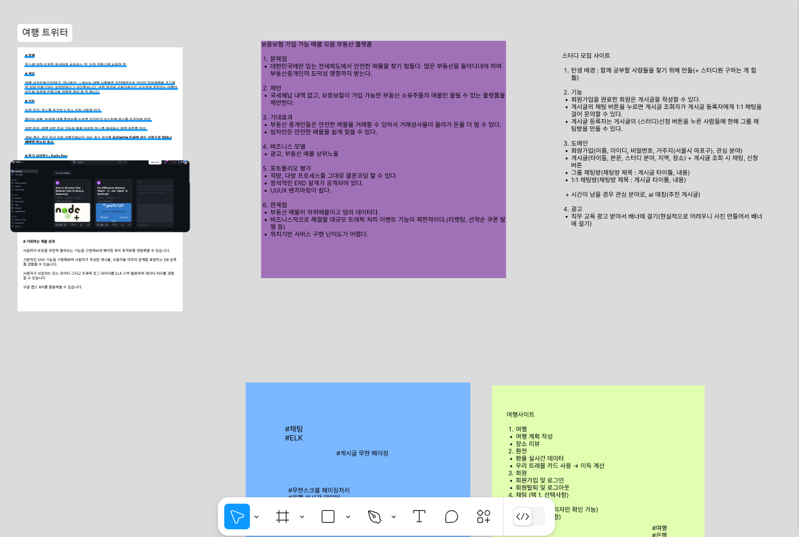
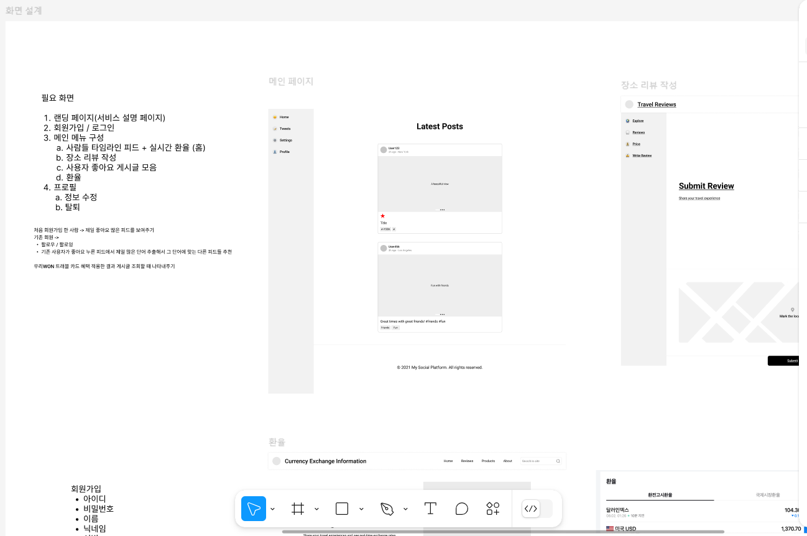
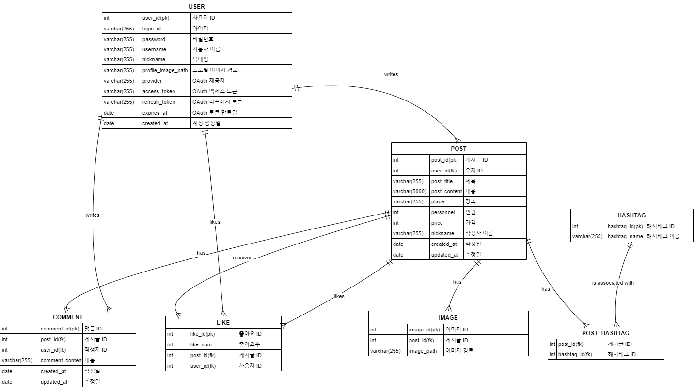

# FISA 클라우드엔지니어링 20일차 (프로젝트 설계)

### 피그마를 사용한 아이디어 브레인 스토밍



### 화면설계 및 데이터 In/Out 설계



### ERD 설계



### 스키마 설계

```java
CREATE TABLE USERS (
    users_id NUMBER PRIMARY KEY,
    login_id VARCHAR2(255) NOT NULL,
    password VARCHAR2(255) NOT NULL,
    username VARCHAR2(255) NOT NULL,
    nickname VARCHAR2(255) NOT NULL,
    profile_image_path VARCHAR2(255),
    provider VARCHAR2(255) NOT NULL,
    access_token VARCHAR2(255) NOT NULL,
    refresh_token VARCHAR2(255) NOT NULL,
    expires_at DATE,
    created_at DATE NOT NULL
);

-- POST 테이블
CREATE TABLE POST (
    post_id NUMBER PRIMARY KEY,
    users_id NUMBER NOT NULL,
    post_title VARCHAR2(255) NOT NULL,
    post_content VARCHAR(4000) NOT NULL,
    place VARCHAR2(255) NOT NULL,
    personnel NUMBER,
    price NUMBER,
    post_likes_count NUMBER NOT NULL,
    nickname VARCHAR2(255) NOT NULL,
    created_at DATE NOT NULL,
    updated_at DATE NOT NULL,
    FOREIGN KEY (users_id) REFERENCES USERS(users_id)
);

-- COMMENT 테이블
CREATE TABLE COMMENTS (
    comments_id NUMBER PRIMARY KEY,
    post_id NUMBER NOT NULL,
    users_id NUMBER NOT NULL,
    comments_content VARCHAR2(255) NOT NULL,
    created_at DATE NOT NULL,
    updated_at DATE NOT NULL,
    FOREIGN KEY (post_id) REFERENCES POST(post_id),
    FOREIGN KEY (users_id) REFERENCES USERS(users_id)
);

-- LIKE 테이블
CREATE TABLE LIKES (
    likes_id NUMBER PRIMARY KEY,
    post_id NUMBER NOT NULL,
    users_id NUMBER NOT NULL,
    FOREIGN KEY (post_id) REFERENCES POST(post_id),
    FOREIGN KEY (users_id) REFERENCES USERS(users_id)
);

-- IMAGE 테이블
CREATE TABLE IMAGE (
    image_id NUMBER PRIMARY KEY,
    post_id NUMBER NOT NULL,
    image_path VARCHAR2(255) NOT NULL,
    FOREIGN KEY (post_id) REFERENCES POST(post_id)
);

-- HASHTAG 테이블
CREATE TABLE HASHTAG (
    hashtag_id NUMBER PRIMARY KEY,
    hashtag_name VARCHAR2(255) NOT NULL
);

-- POST_HASHTAG 테이블
CREATE TABLE POST_HASHTAG (
    post_id NUMBER NOT NULL,
    hashtag_id NUMBER NOT NULL,
    PRIMARY KEY (post_id, hashtag_id),
    FOREIGN KEY (post_id) REFERENCES POST(post_id),
    FOREIGN KEY (hashtag_id) REFERENCES HASHTAG(hashtag_id)
);
```

### 테스트 데이터

```sql
-- USERS 테이블 데이터 삽입
INSERT INTO USERS (users_id, login_id, password, username, nickname, profile_image_path, provider, access_token, refresh_token, expires_at, created_at) VALUES
(1, 'user1', 'password1', 'John Doe', 'johnny', '/images/john.jpg', 'google', 'access_token1', 'refresh_token1', TO_DATE('2025-01-01', 'YYYY-MM-DD'), TO_DATE('2024-01-01', 'YYYY-MM-DD'));
INSERT INTO USERS (users_id, login_id, password, username, nickname, profile_image_path, provider, access_token, refresh_token, expires_at, created_at) VALUES
(2, 'user2', 'password2', 'Jane Doe', 'jane', '/images/jane.jpg', 'facebook', 'access_token2', 'refresh_token2', TO_DATE('2025-02-01', 'YYYY-MM-DD'), TO_DATE('2024-02-01', 'YYYY-MM-DD'));
INSERT INTO USERS (users_id, login_id, password, username, nickname, profile_image_path, provider, access_token, refresh_token, expires_at, created_at) VALUES
(3, 'user3', 'password3', 'Alice', 'alice', '/images/alice.jpg', 'google', 'access_token3', 'refresh_token3', TO_DATE('2025-03-01', 'YYYY-MM-DD'), TO_DATE('2024-03-01', 'YYYY-MM-DD'));
INSERT INTO USERS (users_id, login_id, password, username, nickname, profile_image_path, provider, access_token, refresh_token, expires_at, created_at) VALUES
(4, 'user4', 'password4', 'Bob', 'bobby', '/images/bob.jpg', 'facebook', 'access_token4', 'refresh_token4', TO_DATE('2025-04-01', 'YYYY-MM-DD'), TO_DATE('2024-04-01', 'YYYY-MM-DD'));
INSERT INTO USERS (users_id, login_id, password, username, nickname, profile_image_path, provider, access_token, refresh_token, expires_at, created_at) VALUES
(5, 'user5', 'password5', 'Charlie', 'charlie', '/images/charlie.jpg', 'google', 'access_token5', 'refresh_token5', TO_DATE('2025-05-01', 'YYYY-MM-DD'), TO_DATE('2024-05-01', 'YYYY-MM-DD'));
INSERT INTO USERS (users_id, login_id, password, username, nickname, profile_image_path, provider, access_token, refresh_token, expires_at, created_at) VALUES
(6, 'user6', 'password6', 'David', 'dave', '/images/david.jpg', 'google', 'access_token6', 'refresh_token6', TO_DATE('2025-06-01', 'YYYY-MM-DD'), TO_DATE('2024-06-01', 'YYYY-MM-DD'));
INSERT INTO USERS (users_id, login_id, password, username, nickname, profile_image_path, provider, access_token, refresh_token, expires_at, created_at) VALUES
(7, 'user7', 'password7', 'Eve', 'eve', '/images/eve.jpg', 'facebook', 'access_token7', 'refresh_token7', TO_DATE('2025-07-01', 'YYYY-MM-DD'), TO_DATE('2024-07-01', 'YYYY-MM-DD'));
INSERT INTO USERS (users_id, login_id, password, username, nickname, profile_image_path, provider, access_token, refresh_token, expires_at, created_at) VALUES
(8, 'user8', 'password8', 'Frank', 'frank', '/images/frank.jpg', 'google', 'access_token8', 'refresh_token8', TO_DATE('2025-08-01', 'YYYY-MM-DD'), TO_DATE('2024-08-01', 'YYYY-MM-DD'));
INSERT INTO USERS (users_id, login_id, password, username, nickname, profile_image_path, provider, access_token, refresh_token, expires_at, created_at) VALUES
(9, 'user9', 'password9', 'Grace', 'grace', '/images/grace.jpg', 'facebook', 'access_token9', 'refresh_token9', TO_DATE('2025-09-01', 'YYYY-MM-DD'), TO_DATE('2024-09-01', 'YYYY-MM-DD'));
INSERT INTO USERS (users_id, login_id, password, username, nickname, profile_image_path, provider, access_token, refresh_token, expires_at, created_at) VALUES
(10, 'user10', 'password10', 'Hank', 'hank', '/images/hank.jpg', 'google', 'access_token10', 'refresh_token10', TO_DATE('2025-10-01', 'YYYY-MM-DD'), TO_DATE('2024-10-01', 'YYYY-MM-DD'));

-- POST 테이블 데이터 삽입
INSERT INTO POST (post_id, users_id, post_title, post_content, place, personnel, price, post_likes_count, nickname, created_at, updated_at) VALUES
(1, 1, 'Trip to Paris', 'Wonderful trip to Paris.', 'Paris', 2, 1000, 10, 'johnny', TO_DATE('2024-06-01', 'YYYY-MM-DD'), TO_DATE('2024-06-01', 'YYYY-MM-DD'));
INSERT INTO POST (post_id, users_id, post_title, post_content, place, personnel, price, post_likes_count, nickname, created_at, updated_at) VALUES
(2, 2, 'Mountain Hiking', 'Exciting hike in the mountains.', 'Rocky Mountains', 4, 200, 20, 'jane', TO_DATE('2024-06-02', 'YYYY-MM-DD'), TO_DATE('2024-06-02', 'YYYY-MM-DD'));
INSERT INTO POST (post_id, users_id, post_title, post_content, place, personnel, price, post_likes_count, nickname, created_at, updated_at) VALUES
(3, 3, 'Beach Vacation', 'Relaxing time at the beach.', 'Malibu', 3, 500, 30, 'alice', TO_DATE('2024-06-03', 'YYYY-MM-DD'), TO_DATE('2024-06-03', 'YYYY-MM-DD'));
INSERT INTO POST (post_id, users_id, post_title, post_content, place, personnel, price, post_likes_count, nickname, created_at, updated_at) VALUES
(4, 4, 'City Tour', 'Exploring the city.', 'New York', 1, 300, 40, 'bobby', TO_DATE('2024-06-04', 'YYYY-MM-DD'), TO_DATE('2024-06-04', 'YYYY-MM-DD'));
INSERT INTO POST (post_id, users_id, post_title, post_content, place, personnel, price, post_likes_count, nickname, created_at, updated_at) VALUES
(5, 5, 'Safari Adventure', 'Wildlife safari.', 'Kenya', 5, 1500, 50, 'charlie', TO_DATE('2024-06-05', 'YYYY-MM-DD'), TO_DATE('2024-06-05', 'YYYY-MM-DD'));
INSERT INTO POST (post_id, users_id, post_title, post_content, place, personnel, price, post_likes_count, nickname, created_at, updated_at) VALUES
(6, 6, 'Desert Trekking', 'Journey through the desert.', 'Sahara', 2, 800, 60, 'dave', TO_DATE('2024-06-06', 'YYYY-MM-DD'), TO_DATE('2024-06-06', 'YYYY-MM-DD'));
INSERT INTO POST (post_id, users_id, post_title, post_content, place, personnel, price, post_likes_count, nickname, created_at, updated_at) VALUES
(7, 7, 'Snowy Mountains', 'Skiing and fun in the snow.', 'Alps', 4, 900, 70, 'eve', TO_DATE('2024-06-07', 'YYYY-MM-DD'), TO_DATE('2024-06-07', 'YYYY-MM-DD'));
INSERT INTO POST (post_id, users_id, post_title, post_content, place, personnel, price, post_likes_count, nickname, created_at, updated_at) VALUES
(8, 8, 'Island Getaway', 'Peaceful island vacation.', 'Hawaii', 2, 1200, 80, 'frank', TO_DATE('2024-06-08', 'YYYY-MM-DD'), TO_DATE('2024-06-08', 'YYYY-MM-DD'));
INSERT INTO POST (post_id, users_id, post_title, post_content, place, personnel, price, post_likes_count, nickname, created_at, updated_at) VALUES
(9, 9, 'Historic Tour', 'Visiting historical sites.', 'Rome', 3, 600, 90, 'grace', TO_DATE('2024-06-09', 'YYYY-MM-DD'), TO_DATE('2024-06-09', 'YYYY-MM-DD'));
INSERT INTO POST (post_id, users_id, post_title, post_content, place, personnel, price, post_likes_count, nickname, created_at, updated_at) VALUES
(10, 10, 'Wild West Adventure', 'Exploring the Wild West.', 'Texas', 5, 1100, 100, 'hank', TO_DATE('2024-06-10', 'YYYY-MM-DD'), TO_DATE('2024-06-10', 'YYYY-MM-DD'));

-- COMMENTS 테이블 데이터 삽입
INSERT INTO COMMENTS (comments_id, post_id, users_id, comments_content, created_at, updated_at) VALUES
(1, 1, 2, 'Amazing trip!', TO_DATE('2024-06-01', 'YYYY-MM-DD'), TO_DATE('2024-06-01', 'YYYY-MM-DD'));
INSERT INTO COMMENTS (comments_id, post_id, users_id, comments_content, created_at, updated_at) VALUES
(2, 2, 3, 'Looks exciting!', TO_DATE('2024-06-02', 'YYYY-MM-DD'), TO_DATE('2024-06-02', 'YYYY-MM-DD'));
INSERT INTO COMMENTS (comments_id, post_id, users_id, comments_content, created_at, updated_at) VALUES
(3, 3, 4, 'Wish I was there!', TO_DATE('2024-06-03', 'YYYY-MM-DD'), TO_DATE('2024-06-03', 'YYYY-MM-DD'));
INSERT INTO COMMENTS (comments_id, post_id, users_id, comments_content, created_at, updated_at) VALUES
(4, 4, 5, 'Great post!', TO_DATE('2024-06-04', 'YYYY-MM-DD'), TO_DATE('2024-06-04', 'YYYY-MM-DD'));
INSERT INTO COMMENTS (comments_id, post_id, users_id, comments_content, created_at, updated_at) VALUES
(5, 5, 1, 'Fantastic adventure!', TO_DATE('2024-06-05', 'YYYY-MM-DD'), TO_DATE('2024-06-05', 'YYYY-MM-DD'));
INSERT INTO COMMENTS (comments_id, post_id, users_id, comments_content, created_at, updated_at) VALUES
(6, 6, 2, 'Desert trekking looks amazing!', TO_DATE('2024-06-06', 'YYYY-MM-DD'), TO_DATE('2024-06-06', 'YYYY-MM-DD'));
INSERT INTO COMMENTS (comments_id, post_id, users_id, comments_content, created_at, updated_at) VALUES
(7, 7, 3, 'I want to go skiing!', TO_DATE('2024-06-07', 'YYYY-MM-DD'), TO_DATE('2024-06-07', 'YYYY-MM-DD'));
INSERT INTO COMMENTS (comments_id, post_id, users_id, comments_content, created_at, updated_at) VALUES
(8, 8, 4, 'Island getaway looks relaxing.', TO_DATE('2024-06-08', 'YYYY-MM-DD'), TO_DATE('2024-06-08', 'YYYY-MM-DD'));
INSERT INTO COMMENTS (comments_id, post_id, users_id, comments_content, created_at, updated_at) VALUES
(9, 9, 5, 'Historic tour sounds interesting.', TO_DATE('2024-06-09', 'YYYY-MM-DD'), TO_DATE('2024-06-09', 'YYYY-MM-DD'));
INSERT INTO COMMENTS (comments_id, post_id, users_id, comments_content, created_at, updated_at) VALUES
(10, 10, 6, 'Wild West adventure!', TO_DATE('2024-06-10', 'YYYY-MM-DD'), TO_DATE('2024-06-10', 'YYYY-MM-DD'));

-- LIKES 테이블 데이터 삽입
INSERT INTO LIKES (likes_id, post_id, users_id) VALUES
(1, 1, 3);
INSERT INTO LIKES (likes_id, post_id, users_id) VALUES
(2, 2, 4);
INSERT INTO LIKES (likes_id, post_id, users_id) VALUES
(3, 3, 5);
INSERT INTO LIKES (likes_id, post_id, users_id) VALUES
(4, 4, 1);
INSERT INTO LIKES (likes_id, post_id, users_id) VALUES
(5, 5, 2);
INSERT INTO LIKES (likes_id, post_id, users_id) VALUES
(6, 6, 3);
INSERT INTO LIKES (likes_id, post_id, users_id) VALUES
(7, 7, 4);
INSERT INTO LIKES (likes_id, post_id, users_id) VALUES
(8, 8, 5);
INSERT INTO LIKES (likes_id, post_id, users_id) VALUES
(9, 9, 1);
INSERT INTO LIKES (likes_id, post_id, users_id) VALUES
(10, 10, 2);

-- IMAGE 테이블 데이터 삽입
INSERT INTO IMAGE (image_id, post_id, image_path) VALUES
(1, 1, '/images/paris1.jpg');
INSERT INTO IMAGE (image_id, post_id, image_path) VALUES
(2, 2, '/images/mountain1.jpg');
INSERT INTO IMAGE (image_id, post_id, image_path) VALUES
(3, 3, '/images/beach1.jpg');
INSERT INTO IMAGE (image_id, post_id, image_path) VALUES
(4, 4, '/images/city1.jpg');
INSERT INTO IMAGE (image_id, post_id, image_path) VALUES
(5, 5, '/images/safari1.jpg');
INSERT INTO IMAGE (image_id, post_id, image_path) VALUES
(6, 6, '/images/desert1.jpg');
INSERT INTO IMAGE (image_id, post_id, image_path) VALUES
(7, 7, '/images/snow1.jpg');
INSERT INTO IMAGE (image_id, post_id, image_path) VALUES
(8, 8, '/images/island1.jpg');
INSERT INTO IMAGE (image_id, post_id, image_path) VALUES
(9, 9, '/images/historic1.jpg');
INSERT INTO IMAGE (image_id, post_id, image_path) VALUES
(10, 10, '/images/wildwest1.jpg');

-- HASHTAG 테이블 데이터 삽입
INSERT INTO HASHTAG (hashtag_id, hashtag_name) VALUES
(1, 'travel');
INSERT INTO HASHTAG (hashtag_id, hashtag_name) VALUES
(2, 'adventure');
INSERT INTO HASHTAG (hashtag_id, hashtag_name) VALUES
(3, 'beach');
INSERT INTO HASHTAG (hashtag_id, hashtag_name) VALUES
(4, 'city');
INSERT INTO HASHTAG (hashtag_id, hashtag_name) VALUES
(5, 'safari');
INSERT INTO HASHTAG (hashtag_id, hashtag_name) VALUES
(6, 'desert');
INSERT INTO HASHTAG (hashtag_id, hashtag_name) VALUES
(7, 'snow');
INSERT INTO HASHTAG (hashtag_id, hashtag_name) VALUES
(8, 'island');
INSERT INTO HASHTAG (hashtag_id, hashtag_name) VALUES
(9, 'historic');
INSERT INTO HASHTAG (hashtag_id, hashtag_name) VALUES
(10, 'wildwest');

-- POST_HASHTAG 테이블 데이터 삽입
INSERT INTO POST_HASHTAG (post_id, hashtag_id) VALUES
(1, 1);
INSERT INTO POST_HASHTAG (post_id, hashtag_id) VALUES
(1, 4);
INSERT INTO POST_HASHTAG (post_id, hashtag_id) VALUES
(2, 2);
INSERT INTO POST_HASHTAG (post_id, hashtag_id) VALUES
(3, 3);
INSERT INTO POST_HASHTAG (post_id, hashtag_id) VALUES
(4, 4);
INSERT INTO POST_HASHTAG (post_id, hashtag_id) VALUES
(5, 5);
INSERT INTO POST_HASHTAG (post_id, hashtag_id) VALUES
(6, 6);
INSERT INTO POST_HASHTAG (post_id, hashtag_id) VALUES
(7, 7);
INSERT INTO POST_HASHTAG (post_id, hashtag_id) VALUES
(8, 8);
INSERT INTO POST_HASHTAG (post_id, hashtag_id) VALUES
(9, 9);
INSERT INTO POST_HASHTAG (post_id, hashtag_id) VALUES
(10, 10);

```

### Git 브랜치, 커밋 컨벤션

**⚙️ 브랜치 Type**

| 브랜치 종류 | 설명 |
| --- | --- |
| main | 테스트 서버에서 테스트가 끝나고 운영서버로 배포 할 수 있는 브랜치 |
| dev | 개발을 위한 브랜치. 개발 서버(코드스페이스)에 배포하는 브랜치 |

❗️각자 이름 이니셜로 브랜치를 생성. 브랜치 생성 시 dev 브랜치로 부터 생성.

예를 들어, dev 브랜치로 부터 ajh 브랜치를 만들었다면 ajh에 작업 내용들을 커밋.

마지막으로, dev 브랜치로 ajh 브랜치에서 작업했던 내용을 pull request하여 병합 완료. 

❗️기존 의도는 기능 브랜치를 생성하여 머지 후 삭제였지만 너무 엄격한 설정이 되는 것 같아서 유연한 접근 방식으로 수정.

### Git 명령어

❗️모든 명령어들은 vs code로 프로젝트를 열고 ctrl+`(물결표 버튼) 을 눌러 터미널을 띄운 후 터미널에서 명령어를 입력. 왜냐면 충돌 지점을 자동으로 알려주고 에디터를 통해 수정을 쉽게 할 수 있음.

- 커밋 업로드 하기 전 명령어

```sql
git add .
git commit -m "feat: post기능 구현"
git pull --rebase origin dev
git push
```

**커밋 Type**

| 타입 종류 | 설명 |
| --- | --- |
| feat | 새로운 기능에 대한 커밋 |
| fix | 수정에 대한 커밋 |
| bug | 버그에 대한 커밋 |
| docs | 문서 수정 |
| style | 코드 포맷팅, 세미콜론 누락, 코드 변경이 없는 경우 |
| refactor | 코드 리팩토링 |
| test | 테스트 코드 |
| ci/cd | 빌드 업무 수정 |

## 폴더 구성

```java
.
|-- HELP.md
|-- mvnw
|-- mvnw.cmd
|-- pom.xml
`-- src
    |-- main
    |   |-- java
    |   |   `-- com
    |   |       `-- fisa
    |   |           `-- dailytravel
    |   |               |-- DailytravelApplication.java
    |   |               |-- global
    |   |               |   |-- config
    |   |               |   `-- exception
    |   |               |-- post
    |   |               |   |-- controller
    |   |               |   |-- dto
    |   |               |   |-- exception
    |   |               |   |-- models
    |   |               |   |-- repository
    |   |               |   `-- service
    |   |               `-- user
    |   |                   |-- config
    |   |                   |-- controller
    |   |                   |-- dto
    |   |                   |-- models
    |   |                   |-- repository
    |   |                   `-- service
    |   `-- resources
    |       |-- application.properties
    |       |-- static
    |       `-- templates
    `-- test
        `-- java
            `-- com
                `-- fisa
                    `-- dailytravel
                        `-- DailytravelApplicationTests.java
```

## 네이밍 컨벤션

패키지 이름: 전부 소문자로 적어 이름 충돌을 회피. 또는 단어 단위로 언더바로 분리