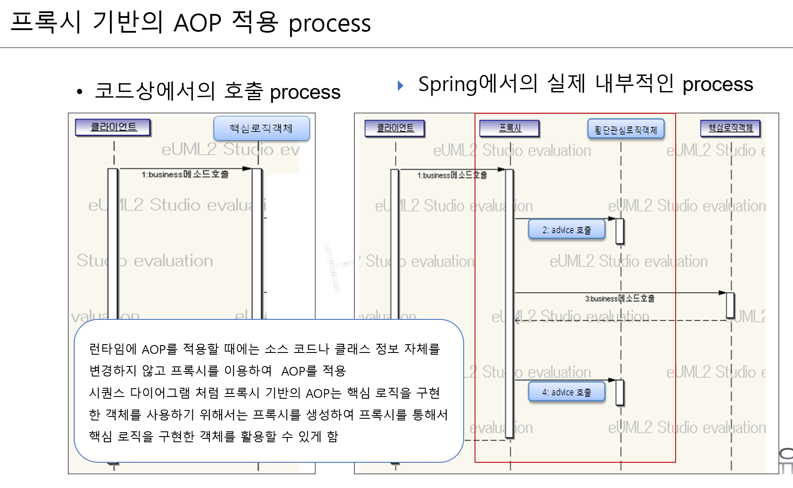

# 26일차

### AOP

- 관점지향 프로그래밍
    - OOP에 추가되면서 개발품질 향상
    - AOP는 OOP 기반의 구조에 적용 권장
    - 근본 framework - AspectJ
        - Spring에서 참조 및 활용
            - spirng 개발 환경상에서 aspectj 라이브러리 설정
            - aspectj의 표현법 target 시점등 설정
                - 링크 :
            - spring에서 aspectj의 기능을 메소드에만 적용
                - 위빙 : 메소드에 실제 실행 시점에 공통 기능을 적용
            - 추가설정 라이브러리
                - biz 구현(spring) + 공통설정 (aspectj&spring) + 동적 바이트 코드 생성 라이브러리(CGLib)
- 전처리, 후처리 코드 철저하게 비즈니스  로직에서 분리
- 로그 기록 등은 필수로 해야할 경우 실제 코드에 코딩 없이 설정만으로 적절한 시점에 자동 적용



### AOP 개발단계

1. 라이브러리 세팅
2. 공통 로직 전처리, 후처리만 구현된 별도의 클래스 개발
    1. 공통 클래스
    2. Aspect 라고도함.
3. 비즈니스 로직 순수 개발
4. 공통기능에 어떤 비즈니스 로직에 어떤 시점에 전처리 또는 후처리 할 것인가를 설정
    1. target
        1. 적용받는 비즈니스 로직 메소드
    2. 시점 : biz target 대상의 시점
        1. 전, 후, 리턴, 예외
    3. 적용 시키는 공통 기능의 메소드
5. 서비스 실행

### AOP 주요 API

1. @Aspect
    1. 공통 기능으로만 구현된 클래스 선언구에 선언 필수
    2. 추가로 코드상에 변수 선언등 불필요
2. @Before
    1. biz 메소드가 호출된 직후 biz 메소드 실행전 실행
3. @After
    1. biz 메소드 실행후 실행
    2. 후처리용
4. AfterReturning
    1. [https://docs.spring.io/spring-framework/reference/core/aop/ataspectj/advice.html#aop-advice-after-returning](https://docs.spring.io/spring-framework/reference/core/aop/ataspectj/advice.html#aop-advice-after-returning)

### Spring Data JPA

주의사항

- entity명에 대소문자 혼용시 자동 생성되는 table명 달라짐
    - EmpCopy → EMP_COPY
    - Empcopy2 → EMPCOPY2
- entity의 맴버변수에 대소문자 혼용시 자동 생성되는 칼럼명이 달라짐
    - empNo → EMP_NO
    - eName → E_NAME
- 최적화된 명명규칙 자동반영

자동 적용되는 명명규칙 반영이 아닌 명시적인 설정

- **@Table(name = "emp_copy3")**
- **@Column(name = “emp_no);**

### **Query Creation**

```java
// select * from emp where ename = 'Smith';
	// find ename by emp2
	public Emp2 findByEname(String ename);
```

- JpaRepository 명명규칙
    - [https://docs.spring.io/spring-data/jpa/docs/2.7.7/reference/html/#jpa.query-methods.query-creation](https://docs.spring.io/spring-data/jpa/docs/2.7.7/reference/html/#jpa.query-methods.query-creation)

### **Named Parameters**

```java
// 사번으로 부서번호 수정 메소드
	/**
	 * update emp2 set deptno = ? where empno = ?
	 *  - 동적바인딩 표현
	 *  	- ? or :변수명
	 * 필요데이터 : 사번과 갱신용부서번호
	 * insert/update/delete 후 반드시 commit or rollback 
	 * 
	 * sql문장으로 개발 기술 학습 table명 기준 entity명 기준
	 */
	
	@Modifying // DML 사용시 필수
	@Query("update Emp2 e set e.deptno = :deptno where e.empno = :empno")
	public int updateByEmpnoDeptno(@Param("empno") int empno, @Param("deptno") int deptno);
```

- 사용예제: [https://docs.spring.io/spring-data/jpa/docs/2.7.7/reference/html/#jpa.named-parameters](https://docs.spring.io/spring-data/jpa/docs/2.7.7/reference/html/#jpa.named-parameters)

### Respository 개발시 주의사항

- DML 작성시
- @Transactional - service
- @Query 설정시 - Repository에 @Modifying